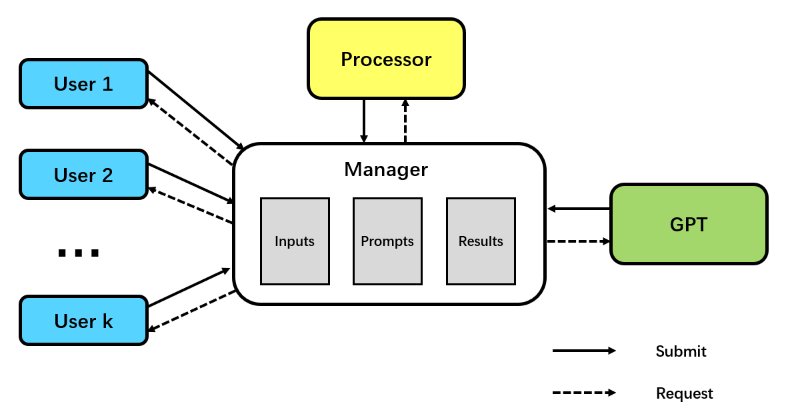
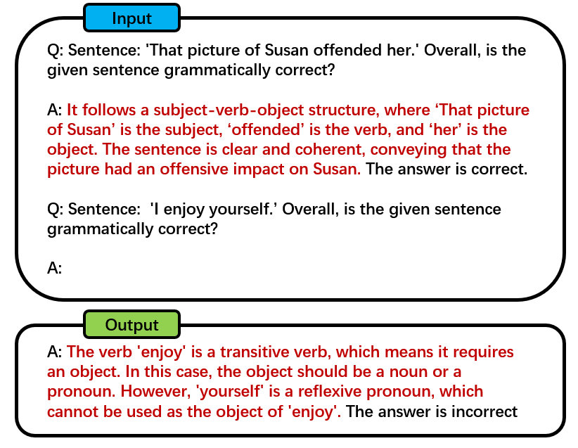

# 2023北大软微夏令营项目
**项目要求**：一个多线程、可复用、能够异常处理、断点重爬的OpenAI API调用代码，解决文本分类问题

**完成情况**：实现了用户端的多线程（同时向多个用户提供服务）的处理框架，实现了对API调用的简单异常处理，完成API调用异常处理后的断点重爬，支持四个NLU数据集：SNLI、FEVER、QQP、CoLA （采用 few-shot + CoT）

- **项目难点**： 
    1. 如何处理、调度多个并行的任务 
    2. API调用异常后如何处理
    3. 如何为多个任务多个例子设计CoT
- **解决方法**： 
    1. 采用数据统一管理、调度的方法,通过专有数据接口保持数据的一致性
    2. 将API调用与前面的操作解耦,设置缓冲变量保证出现异常后重新请求不影响程序正常运行
    3. 利用GPT生成，再进行人工筛选
### 架构：
#### overview
整个调用程序由User、Processor、Manager、GPT共四个模块构成。User代表需要解决问题的用户；Processor用于将用户输入处理生成API调用时的prompt、Manager负责数据的储存、调度；GPT负责直接调用API。整个架构运行如下图所示：

程序运行时,多个User实例并行提交输入, Processor实例对输入进行处理, GPT实例负责API调用,所有的数据读写通过Manager实例的接口完成。
1. Manager
   - 作用：整个架构中唯一负责管理数据的类, 对user、processor、gpt实例提供专门的数据接口，保持数据的一致性。
   - 设计：有inputs_pool, prompts_pool, results_pool三个容器，分别存储所有用户的输入、处理后的prompt、所有用户的回复结果。储存顺序按照时间升序排列。每个容器提供对应的request、submit接口。
2. User
   - 作用：一个User实例代表一个用户，每个用户一次只解决一种任务，每个用户之间互不影响，可以并行。 
   - 设计：每个user由唯一的id标识, 有唯一对应的task, 需要解决的数据集data以及一个存储结果的result_pool。user可以通过接口向manager提交输入, 以及请求回复结果。 
3. Processor
   - 作用：负责对Manager收集的用户输入进行处理,根据不同的任务加工成对应的prompt
   - 设计：内置了每个任务的prompt处理方法，通过Manager提供的接口获得用户输入,提交prompt.
   - prompt里设置了一个缓冲变量,用于临时储存gpt请求的prompt,当API调用失败重新请求时会优先返回缓冲变量。
4. GPT
   - 作用：直接负责调用API,并进行简单的异常处理
   - 设计：使用了Openai库中的API调用代码, 通过Manager提供的接口获得prompt,提交回复结果。
   - 调用异常时打印错误信息,并且sleep一段时间后(不影响其他部分)重新请求
#### 运行结果
1. 数据集：一共选取了四个NLU子任务和对应的数据集：
   1. SNLI：需要判断premise和hypothesis之间的逻辑关系，共有三个标签 entailment、neutral、contradiction.
   2. FEVER：判断evidence是否支持claim, 有三个标签 supports, refutes, not enough information.
   3. QQP：需要判断一对问题在语义上是否等效,有两个标签 equivalent, not equivalent
   4. CoLA：判断一个句子是否合乎语法, 有两个标签0（不符合语法）、1（符合语法）
2. prompt设计
   1. few-shot prompting: 考虑到fewer-shot的方法能提高分类性能, 我们为每个任务的每个类别选定了一个demonstration的例子（人工挑选了比较典型又没有歧义的句子）做few-shot。
   2. CoT：之前的工作发现在涉及到推理（比如数学）的问题上引入chain-of-thought来鼓励模型生成答案的同时给出推理过程可以提高准确率。但是这里涉及到多个任务，每个用于demonstration的例子都需要一个推理过程，人工设计比较困难(主要是没时间啦)。 这里我采利用GPT生成chain-of-thought：
      - 为每一个任务设计一个prompt, 让gpt给出每个例子标签的推理过程,然后人工筛选出合理的作为结果。
    3. prompt格式：
3. 运行过程：log.txt里记录了一次程序完整运行的日志。
4. evaluate：
   - 测试集：考虑到API调用的频率限制,加上token is money！我们从每个数据集的development set中随机采样了12个样本作为我们的测试集，测试集中每个类别的样本数是均衡的
   - 评价指标：
     1. 准确率Acc.
     2. F1-score（QQP 和 CoLA）
   - 直接zero-shot的结果：
        |Dataset|Acc|F1-score|
        |---|---|---|
        |SNLI|83.3|75.8|
        |FEVER|58.3|61.5|
        |QQP|75.0|76.9|
        |CoLA|50.0|57.1|
    - few-shot + CoT的结果：
        |Dataset|Acc|F1-score|
        |---|---|---|
        |SNLI|91.7|90.9|
        |FEVER|58.3|66.7|
        |QQP|83.3|83.3|
        |CoLA|66.6|71.4|
    - 虽然测试集的数据量比较小，随机性比较大，但还是发现few-shot+CoT下的结果更好